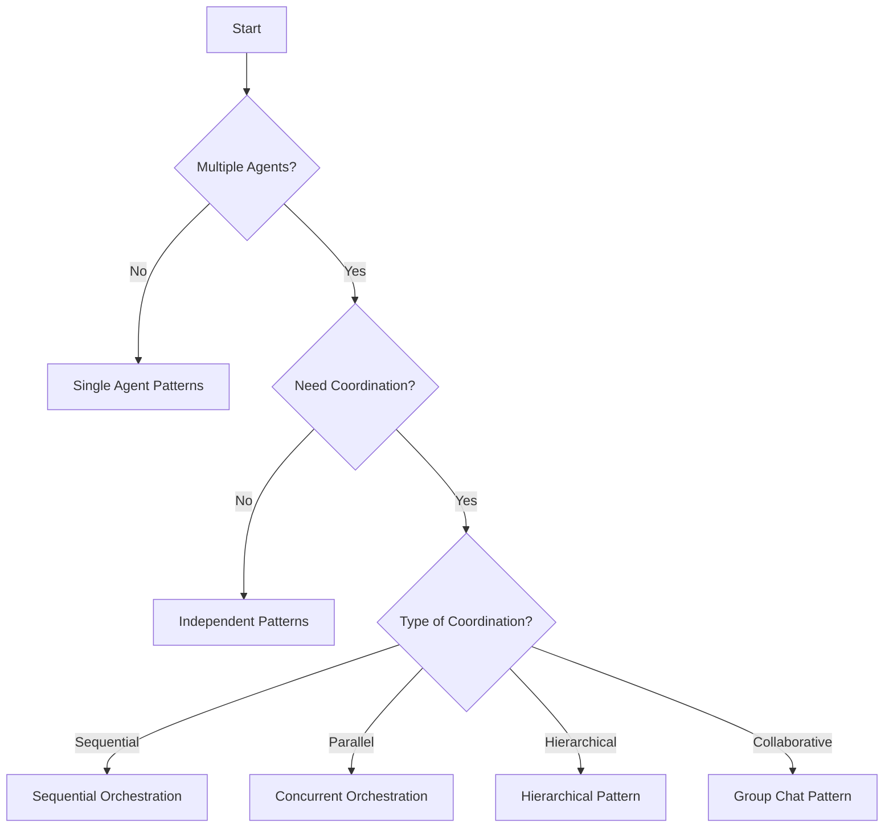

# 🤖 Agentic Patterns Library

> A comprehensive collection of battle-tested patterns for building multi-agent systems at scale

[](https://opensource.org/licenses/MIT)
[](./reference/patterns-index.md)
[](https://github.com/thisisartium/agentic-patterns/pulls)

## 🎯 What is This?

The **Agentic Patterns Library** is a curated collection of design patterns, implementation templates, and best practices for building production-ready multi-agent systems. Whether you're orchestrating LLM agents, building autonomous workflows, or designing distributed AI systems, these patterns provide proven solutions to common challenges.

## 🚀 Quick Start

### Explore Patterns Online

**Option 1: View on GitHub Pages** (Recommended)
- [Interactive Pattern Browser](https://thisisartium.github.io/agentic-patterns/tools/pattern-browser.html) - Search and filter patterns
- [Pattern Selector Tool](https://thisisartium.github.io/agentic-patterns/tools/pattern-selector.html) - Find the right pattern

**Option 2: View Locally**
```bash
# Clone and open the HTML files directly
git clone https://github.com/thisisartium/agentic-patterns
cd agentic-patterns
# Open in your browser:
open tools/pattern-browser.html  # macOS
# OR
xdg-open tools/pattern-browser.html  # Linux
# OR simply drag the HTML file to your browser
```

### Try a Pattern in 5 Minutes

```bash
# Clone the repository
git clone https://github.com/thisisartium/agentic-patterns
cd agentic-patterns

# Run the example implementation
python examples/python-implementation.py
```

### Find the Right Pattern

Not sure which pattern to use? Try our [Pattern Selector Tool](https://thisisartium.github.io/agentic-patterns/tools/pattern-selector.html) or check out the decision flowchart:



## 📚 Pattern Categories

### Foundation Patterns (Required Infrastructure)
- **Agent Registry** - Dynamic agent discovery and registration
- **Message Transport** - Reliable inter-agent communication
- **Lifecycle Management** - Agent lifecycle orchestration

### Communication Patterns
- **Request-Reply** - Synchronous query-response
- **Publish-Subscribe** - Event-driven fan-out
- **Blackboard** - Shared collaborative workspace
- **Model Context Protocol** - Controlled tool access

### Orchestration Patterns
- **Sequential** - Linear task execution
- **Concurrent** - Parallel task processing
- **Hierarchical** - Manager-worker delegation
- **Market-Based** - Auction-based allocation

### Context Management
- **Shared Memory** - Centralized state store
- **Progressive Compression** - Context size management
- **Semantic Memory** - Knowledge retrieval

[View all 50+ patterns →](./reference/patterns-index.md)

## 🛠️ Implementations

Ready-to-use implementations in multiple languages:

### Python
```python
# See examples/python-implementation.py for full working example
from agentic_patterns import AgentRegistry, MessageBus

# Create a registry for agent discovery
registry = AgentRegistry()

# Register an agent with capabilities
registry.register(
    agent_id="translator-001",
    capabilities=["translation", "summarization"],
    languages=["en", "es", "fr"]
)

# Discover agents by capability
translators = registry.discover(capability="translation", language="es")
```

[Browse example implementation →](./examples/)

## 🏗️ Real-World Use Cases

- **E-Commerce Assistant** - Multi-agent customer support system
- **Research Platform** - Distributed research agents with shared knowledge base
- **DevOps Automation** - Self-healing infrastructure with agent swarms
- **Financial Analysis** - Market-based coordination for portfolio optimization

## 🔧 Tools & Utilities

### Interactive Tools
**View these tools online (GitHub Pages):**
- [Pattern Selector Tool](https://thisisartium.github.io/agentic-patterns/tools/pattern-selector.html) - Find the right pattern for your use case
- [Pattern Browser](https://thisisartium.github.io/agentic-patterns/tools/pattern-browser.html) - Search and filter all patterns

**Or run locally:**
```bash
cd tools/
python -m http.server 8000  # Python 3
# Then open http://localhost:8000 in your browser
```

## 📊 Performance Benchmarks

Compare patterns across key metrics:

| Pattern | Latency (p50) | Throughput | Memory | Complexity |
|---------|---------------|------------|---------|------------|
| Request-Reply | 10ms | High | Low | Low |
| Pub-Sub | 5ms | Very High | Medium | Medium |
| Hierarchical | 50ms | Medium | High | Medium |
| Market-Based | 100ms | Low | High | High |


## 🎓 Learning Resources

### Getting Started
- [Full Pattern Documentation](./reference/patterns-full.md)
- [Concise Pattern Reference](./reference/patterns-concise.md)
- [Pattern Index by Category](./reference/patterns-index.md)
- [Example Python Implementation](./examples/python-implementation.py)

## 🤝 Contributing

We welcome contributions! Whether it's a new pattern, implementation, or improvement:

1. Fork the repository
2. Browse [Issues](https://github.com/thisisartium/agentic-patterns/issues)
3. Submit a pull request

### Pattern Proposal Template
```yaml
name: Your Pattern Name
category: orchestration|communication|context|...
maturity: experimental|emerging|mature
problem: What problem does this solve?
forces: What tensions exist?
solution: How does the pattern work?
```


## 🗺️ Roadmap

- [ ] **Q1 2025**: Pattern playground with online sandboxes
- [ ] **Q2 2025**: Visual pattern designer tool
- [ ] **Q3 2025**: Pattern composition framework
- [ ] **Q4 2025**: Production deployment templates

## 📄 License

This project is licensed under the MIT License.

## 🙏 Acknowledgments

- Inspired by Gang of Four patterns and enterprise integration patterns
- Based on real-world multi-agent system implementations

## 📞 Support

- 🐛 Issues: [GitHub Issues](https://github.com/thisisartium/agentic-patterns/issues)
- 📖 Documentation: [Pattern Index](./reference/patterns-index.md)

---

<p align="center">
  Made with ❤️ by the Agentic Patterns Community
</p>

