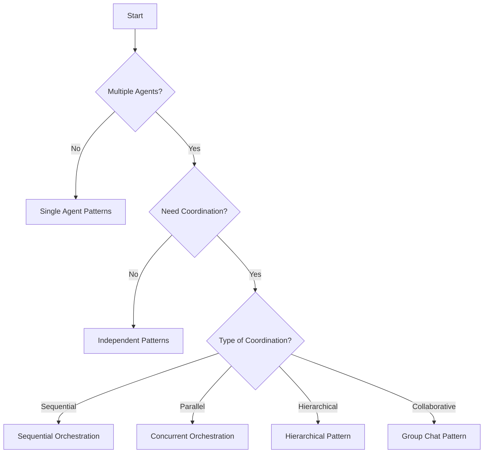

# 🤖 Agentic Patterns Library

> A comprehensive collection of battle-tested patterns for building multi-agent systems at scale

[](https://opensource.org/licenses/MIT)
[](./patterns-catalog)
[](./CONTRIBUTING.md)
[](https://agentic-patterns.dev)

## 🎯 What is This?

The **Agentic Patterns Library** is a curated collection of design patterns, implementation templates, and best practices for building production-ready multi-agent systems. Whether you're orchestrating LLM agents, building autonomous workflows, or designing distributed AI systems, these patterns provide proven solutions to common challenges.

## 🚀 Quick Start

### Explore Patterns Online
Visit our [Interactive Pattern Explorer](https://agentic-patterns.dev/explorer) to browse patterns by category, maturity, and use case.

### Try a Pattern in 5 Minutes

```bash
# Clone the repository
git clone https://github.com/yourusername/agentic-patterns
cd agentic-patterns

# Run a simple agent registry pattern example
docker-compose -f playground/docker/agent-registry.yml up

# Or use our CLI to scaffold a new project
npx create-agentic-system --pattern hierarchical --language python my-agent-system
```

### Find the Right Pattern

Not sure which pattern to use? Try our [Pattern Selector Tool](./tools/pattern-selector.html) or check out the decision flowchart:



## 📚 Pattern Categories

### Foundation Patterns (Required Infrastructure)
- **[Agent Registry](./docs/patterns/foundation/agent-registry.md)** - Dynamic agent discovery and registration
- **[Message Transport](./docs/patterns/foundation/message-transport.md)** - Reliable inter-agent communication
- **[Lifecycle Management](./docs/patterns/foundation/lifecycle-management.md)** - Agent lifecycle orchestration

### Communication Patterns
- **[Request-Reply](./docs/patterns/communication/request-reply.md)** - Synchronous query-response
- **[Publish-Subscribe](./docs/patterns/communication/publish-subscribe.md)** - Event-driven fan-out
- **[Blackboard](./docs/patterns/communication/blackboard.md)** - Shared collaborative workspace
- **[Model Context Protocol](./docs/patterns/communication/mcp.md)** - Controlled tool access

### Orchestration Patterns
- **[Sequential](./docs/patterns/orchestration/sequential.md)** - Linear task execution
- **[Concurrent](./docs/patterns/orchestration/concurrent.md)** - Parallel task processing
- **[Hierarchical](./docs/patterns/orchestration/hierarchical.md)** - Manager-worker delegation
- **[Market-Based](./docs/patterns/orchestration/market-based.md)** - Auction-based allocation

### Context Management
- **[Shared Memory](./docs/patterns/context/shared-memory.md)** - Centralized state store
- **[Progressive Compression](./docs/patterns/context/compression.md)** - Context size management
- **[Semantic Memory](./docs/patterns/context/semantic-memory.md)** - Knowledge retrieval

[View all 75+ patterns →](./reference/patterns-index.md)

## 🛠️ Implementations

Ready-to-use implementations in multiple languages:

### Python
```python
# See examples/python-implementation.py for full working example
from agentic_patterns import AgentRegistry, MessageBus

# Create a registry for agent discovery
registry = AgentRegistry()

# Register an agent with capabilities
registry.register(
    agent_id="translator-001",
    capabilities=["translation", "summarization"],
    languages=["en", "es", "fr"]
)

# Discover agents by capability
translators = registry.discover(capability="translation", language="es")
```

### TypeScript
```typescript
import { HierarchicalOrchestrator, Worker } from 'agentic-patterns';

const orchestrator = new HierarchicalOrchestrator();
const workers = [
    new Worker('research', researchConfig),
    new Worker('analysis', analysisConfig),
    new Worker('reporting', reportingConfig)
];

await orchestrator.execute(task, workers);
```

[Browse all implementations →](./examples/)

## 🏗️ Real-World Case Studies

Learn from production deployments:

- **[E-Commerce Assistant](./case-studies/e-commerce-assistant)** - Multi-agent customer support system handling 10K+ queries/day
- **[Research Platform](./case-studies/research-platform)** - Distributed research agents with shared knowledge base
- **[DevOps Automation](./case-studies/devops-automation)** - Self-healing infrastructure with agent swarms
- **[Financial Analysis](./case-studies/financial-analysis)** - Market-based coordination for portfolio optimization

## 🔧 Tools & Utilities

### Pattern Selector
Interactive tool to find the right pattern for your use case
```bash
npm install -g agentic-patterns-cli
agentic-patterns select
```

### Pattern Validator
Ensure your implementation follows pattern best practices
```bash
agentic-patterns validate --pattern agent-registry src/
```

### Visualization Tools
Generate architecture diagrams from pattern configurations
```bash
agentic-patterns visualize config.yaml --output architecture.png
```

## 📊 Performance Benchmarks

Compare patterns across key metrics:

| Pattern | Latency (p50) | Throughput | Memory | Complexity |
|---------|---------------|------------|---------|------------|
| Request-Reply | 10ms | High | Low | Low |
| Pub-Sub | 5ms | Very High | Medium | Medium |
| Hierarchical | 50ms | Medium | High | Medium |
| Market-Based | 100ms | Low | High | High |

[View detailed benchmarks →](./benchmarks)

## 🎓 Learning Resources

### Getting Started
- [What are Agentic Patterns?](./docs/getting-started/introduction.md)
- [Your First Multi-Agent System](./docs/getting-started/first-system.md)
- [Pattern Selection Guide](./docs/getting-started/selection-guide.md)

### Workshops
- **Beginner**: Building Your First Agent Registry (2 hours)
- **Intermediate**: Orchestration Patterns Deep Dive (4 hours)
- **Advanced**: Production-Ready Multi-Agent Platforms (8 hours)

### Video Tutorials
- [YouTube Playlist: Agentic Patterns Explained](https://youtube.com/...)
- [Pattern of the Week Series](https://youtube.com/...)

## 🤝 Contributing

We welcome contributions! Whether it's a new pattern, implementation, or improvement:

1. Check our [Contributing Guide](./CONTRIBUTING.md)
2. Browse [Good First Issues](https://github.com/yourusername/agentic-patterns/issues?q=is%3Aissue+is%3Aopen+label%3A%22good+first+issue%22)
3. Join our [Discord Community](https://discord.gg/...)

### Pattern Proposal Template
```yaml
name: Your Pattern Name
category: orchestration|communication|context|...
maturity: experimental|emerging|mature
problem: What problem does this solve?
forces: What tensions exist?
solution: How does the pattern work?
```

## 📈 Adoption

Used by teams at:

<p align="center">
  
</p>

## 🗺️ Roadmap

- [ ] **Q1 2025**: Pattern playground with online sandboxes
- [ ] **Q2 2025**: Visual pattern designer tool
- [ ] **Q3 2025**: Pattern composition framework
- [ ] **Q4 2025**: Production deployment templates

## 📄 License

This project is licensed under the MIT License - see the [LICENSE](LICENSE) file for details.

## 🙏 Acknowledgments

- Original patterns research by [Team/Authors]
- Community contributors (see [CONTRIBUTORS.md](./CONTRIBUTORS.md))
- Inspired by Gang of Four patterns and enterprise integration patterns

## 📞 Support

- 📧 Email: patterns@agentic.dev
- 💬 Discord: [Join our community](https://discord.gg/...)
- 🐛 Issues: [GitHub Issues](https://github.com/yourusername/agentic-patterns/issues)
- 📖 Documentation: [agentic-patterns.dev](https://agentic-patterns.dev)

---

<p align="center">
  Made with ❤️ by the Agentic Patterns Community
</p>

<p align="center">
  <a href="https://star-history.com/#yourusername/agentic-patterns&Date">
    
  </a>
</p>